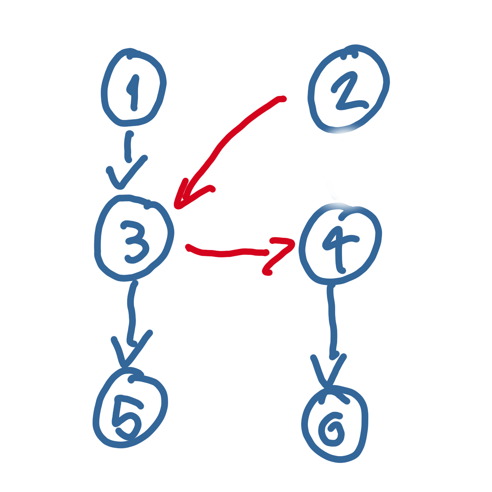

# PDG - ideas and notes

## Generate invocation chains

The invocation chains are created in two steps, first, certain number of independent (like a linear sequence) chains are created, then these chains are crossed randomly with each other.
The crossing can be performed in two ways as seen in the following images.

Two independent chains.

First way to cross two chains.

Second way to cross two chains.

### Parameters to generate the chains 

#### Actual parameters
- Number of classes
- Methods for each class (range)
- Length of the chain (range)
- Number of independent chains to create
- Number of crosses to perform between chains

#### Parameters to bre implemented
- LOC in a method (range)
- CYCLO (range)
- Method types to generate
- fan-out of method (range, with probability function) 

### Output
- Number of chains
- List of the chains
- Metrics
